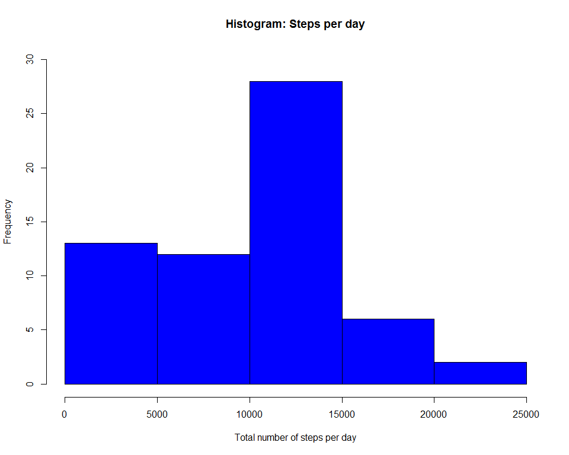
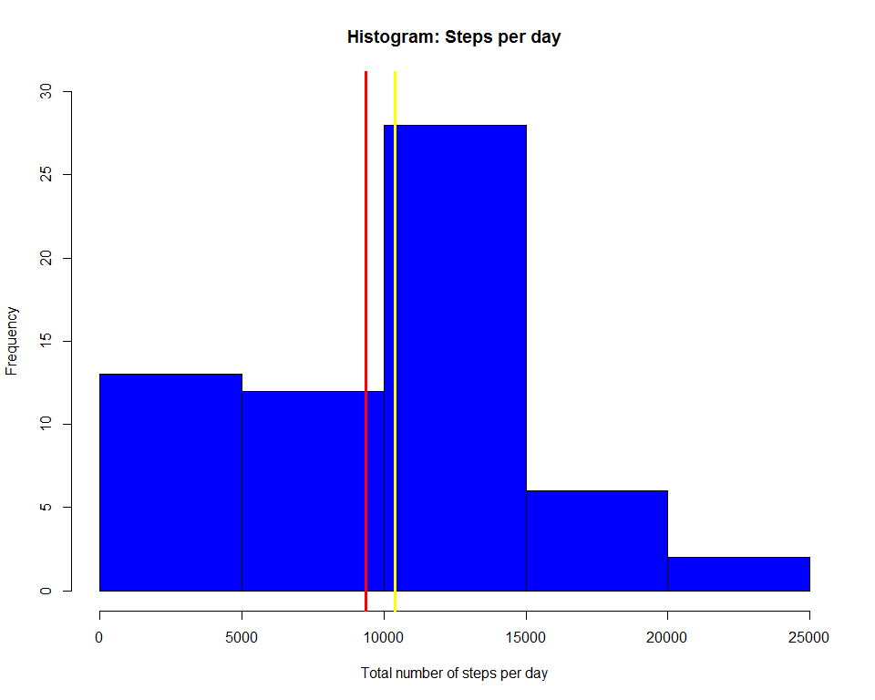
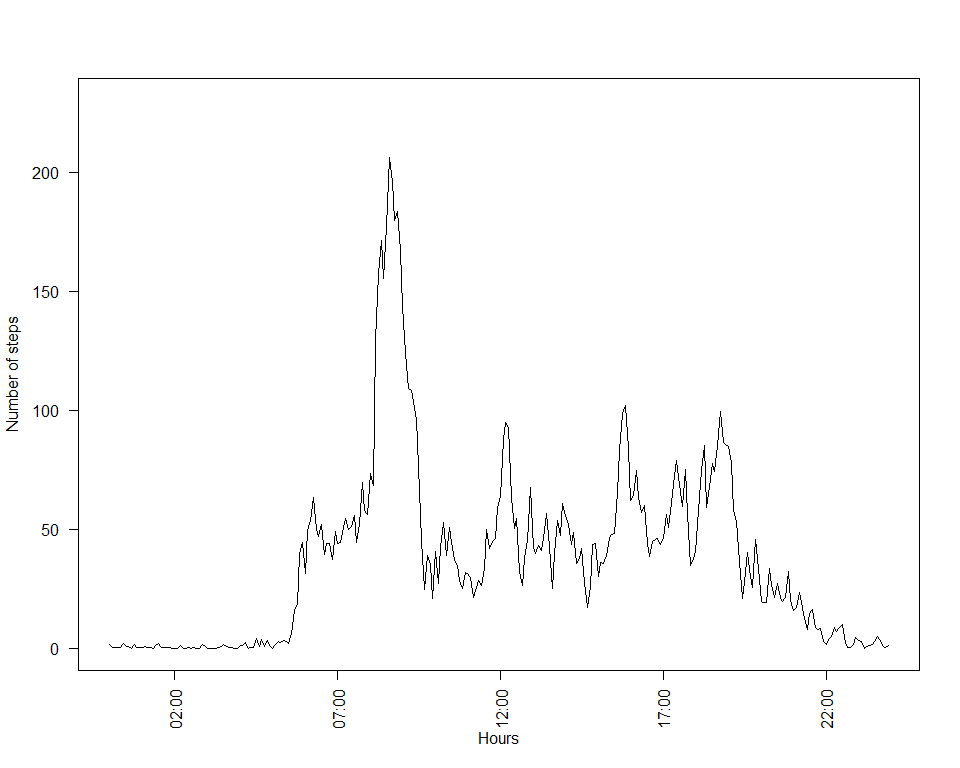
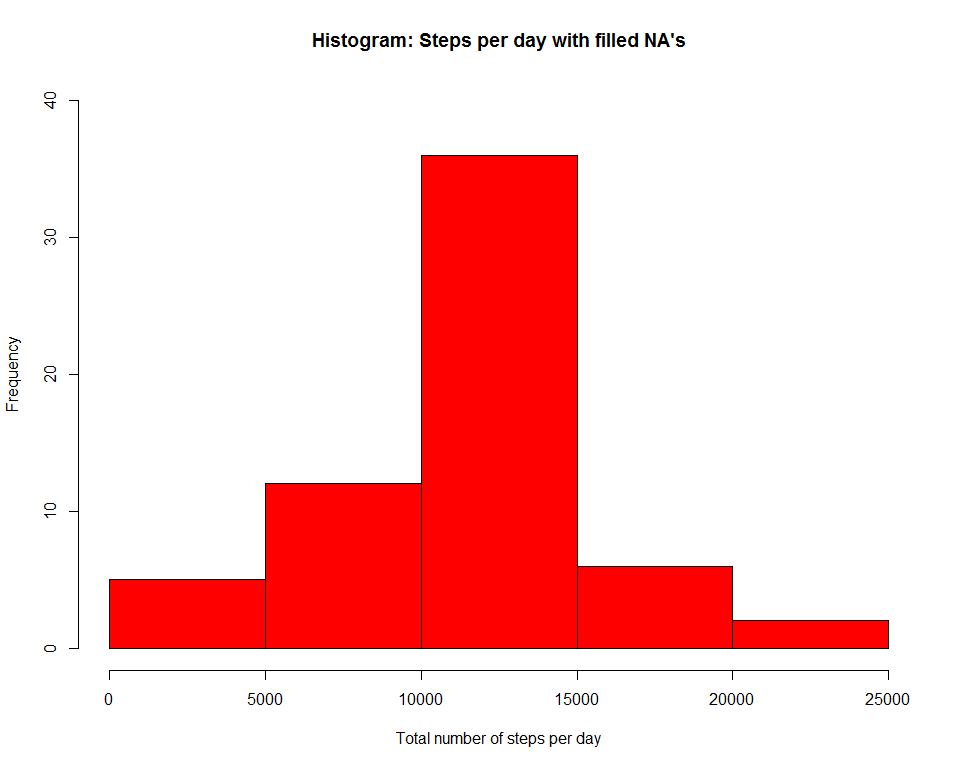
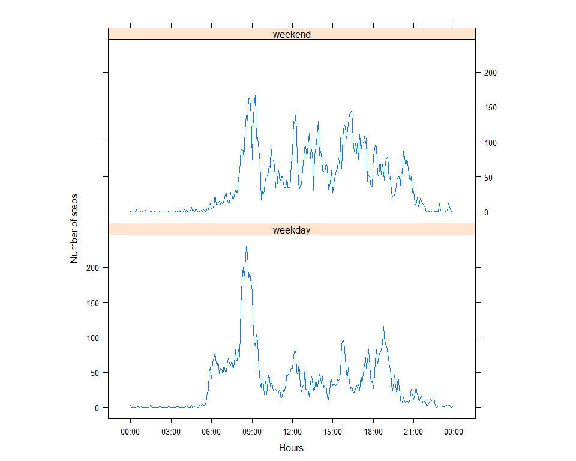

# Reproducible Research: Peer Assessment 1
by Andrey Zaitcev

## 0. Introduction

It is now possible to collect a large amount of data about personal movement using activity monitoring devices such as a Fitbit, Nike Fuelband, or Jawbone Up. These type of devices are part of the “quantified self” movement – a group of enthusiasts who take measurements about themselves regularly to improve their health, to find patterns in their behavior, or because they are tech geeks. But these data remain under-utilized both because the raw data are hard to obtain and there is a lack of statistical methods and software for processing and interpreting the data.

This assignment makes use of data from a personal activity monitoring device. This device collects data at 5 minute intervals through out the day. The data consists of two months of data from an anonymous individual collected during the months of October and November, 2012 and include the number of steps taken in 5 minute intervals each day.

The data for this assignment can be downloaded from the course web site:

Dataset: [Activity monitoring data](https://d396qusza40orc.cloudfront.net/repdata%2Fdata%2Factivity.zip) [52K]
The variables included in this dataset are:

* steps: Number of steps taking in a 5-minute interval (missing values are coded as NA)
* date: The date on which the measurement was taken in YYYY-MM-DD format
* interval: Identifier for the 5-minute interval in which measurement was taken

The dataset is stored in a comma-separated-value (CSV) file and there are a total of 17,568 observations in this dataset.

## 1. Load requiered dependencies
Development environment: Windows 8.1en x64, R version 3.3.0, RStudio Version 0.99.489.

In this project i use this external libraries to work with data, time and graphics.

```r
library(dplyr)
library(timeDate)
library(lattice)
```

## 2. Loading and preprocessing the data
By default i have a zip archive in the same folder with R files. Next step i unzip data in special folder.

```r
unzip(zipfile="./activity.zip",exdir="./data")
df <- read.csv("./data/activity.csv")
```

## 3. What is mean total number of steps taken per day?

The total steps per day are displayed as a histogram.


```r
steps_each_day <- aggregate(df$steps, by=list(df$date),FUN=sum, na.rm=TRUE)

hist(steps_each_day$x, col = "blue", main = paste("Histogram: Steps per day"), 
     xlab = "Total number of steps per day",ylim = c(0, 30), breaks = 7)
```

<!-- -->

Calculate and report the **mean** and **median** total number of steps taken per day.

```r
step_mean <- mean(steps_each_day$x,na.rm = TRUE)
step_mean
```

```
## [1] 9354.23
```

```r
step_median <- median(steps_each_day$x,na.rm = TRUE)
step_median
```

```
## [1] 10395
```

Lets add this info on graphic!


```r
hist(steps_each_day$x, col = "blue", main = paste("Histogram: Steps per day"), 
     xlab = "Total number of steps per day",ylim = c(0, 30), breaks = 7)
abline(v=step_mean, col="red", lwd=3)
abline(v=step_median, col="yellow", lwd=3)
```

<!-- -->
 The values are:
 
* The **mean** total number of steps taken per day is 9354 steps.
* The **median** total number of steps taken per day is 10395 steps.

## 4. What is the average daily activity pattern?

Make a time series plot (i.e. type = "l") of the 5-minute interval (x-axis) and the average number of steps taken, averaged across all days (y-axis)


```r
steps_activity <- aggregate(df$steps, by=list(df$interval),FUN=mean, na.rm=TRUE)

#this code block convert time period from 0 to 0000, 0910 to 09:10 and etc
steps_activity$Group.1 <- sprintf("%04d", steps_activity$Group.1)
steps_activity$Group.1 <- format(strptime(steps_activity$Group.1, format="%H%M"), format = "%H:%M")
steps_activity$Group.1 <- as.POSIXct(steps_activity$Group.1,format="%H:%M")

plot(x ~ Group.1, data = steps_activity, type = "l", ylim = c(0, 230),las=2, ylab = "Number of steps", xlab = "Hours")
```

<!-- -->

Which 5-minute interval, on average across all the days in the dataset, contains the maximum number of steps?

```r
format(steps_activity[which.max(steps_activity$x), ]$Group.1,"%H:%M")
```

```
## [1] "08:35"
```
It's a **835** interval, or at 08:35 were the average maximum user activity.

## 5. Imputing missing values
Note that there are a number of days/intervals where there are missing values (coded as NA). 

Calculate and report the total number of missing values in the dataset (i.e. the total number of rows with NAs)

```r
df_filled <- df
sum(is.na(df_filled$steps))
```

```
## [1] 2304
```
In total 2304 rows are missing.

Devise a strategy for filling in all of the missing values in the dataset. 
I prefer to use a mean for a 5-minute interval.


```r
df_filled <- transform(df_filled, steps = ifelse(is.na(df_filled$steps), steps_activity$x, df_filled$steps))

total_steps <- aggregate(df_filled$steps, by=list(df_filled$date),FUN=sum, na.rm=FALSE)
```

Now let's make a histogram of the total number of steps taken each day. 


```r
hist(total_steps$x, col = "red", main = paste("Histogram: Steps per day with filled NA's"), 
     xlab = "Total number of steps per day", ylim = c(0, 40), breaks = 7)
```

<!-- -->

Calculate and report the **mean** and **median** total number of steps taken per day with filled NA values.


```r
mean(total_steps$x,na.rm = FALSE)
```

```
## [1] 10766.19
```

```r
median(total_steps$x,na.rm = FALSE)
```

```
## [1] 10766.19
```
 The values are:
 
* The **mean** total number of steps taken per day is 10766 steps.
* The **median** total number of steps taken per day is 10766 steps.

Do these values differ from the estimates from the first part of the assignment? What is the impact of imputing missing data on the estimates of the total daily number of steps?

* Yes. Mean value of steps growed from 9354 to 10766, and median growed from 10395 to 10766.The reason is that in the original data: some days were with NA's for any interval. The total number of steps taken in such days are set to 0s by default. After replacing missing steps values with the mean steps of associated interval value, these 0 values are removed from the histogram of total number of steps taken each day.

## 6. Are there differences in activity patterns between weekdays and weekends?

Create a new factor variable in the dataset with two levels – “weekday” and “weekend” indicating whether a given date is a weekday or weekend day.
Instead of weekdays() i prefer to use fucntion isWeekday() from package timeDate.

```r
df_days <- df_filled
df_days <- df_days %>% mutate(type_of_day = factor(ifelse(isWeekday(df_days$date,wday = 1:5), "weekday" ,"weekend")))
```

Make a panel plot containing a time series plot (i.e. type = "l") of the 5-minute interval (x-axis) and the average number of steps taken, averaged across all weekday days or weekend days (y-axis).


```r
stepsByDay <- aggregate(df_days$steps ~ df_days$interval + df_days$type_of_day, df_days, mean)

#this code block convert time period from 0 to 0000 0910 to 09:10 and etc
stepsByDay$`df_days$interval` <- sprintf("%04d", stepsByDay$`df_days$interval`)
stepsByDay$`df_days$interval` <- format(strptime(stepsByDay$`df_days$interval`, format="%H%M"), format = "%H:%M")
stepsByDay$`df_days$interval` <- as.POSIXct(stepsByDay$`df_days$interval`,format="%H:%M")

xyplot(stepsByDay$`df_days$steps` ~ stepsByDay$`df_days$interval` | factor(stepsByDay$`df_days$type_of_day`), 
       data = stepsByDay, aspect = 1/2, type = "l", xlab = "Hours", ylab = "Number of steps", scales=list(x=list(tick.number=9)))
```

<!-- -->
After comparing the graphics it's possible to say: people move on weekend in average more than on weekdays, also in weekday morning people make lots of steps, perhaps not to be late at work :)
